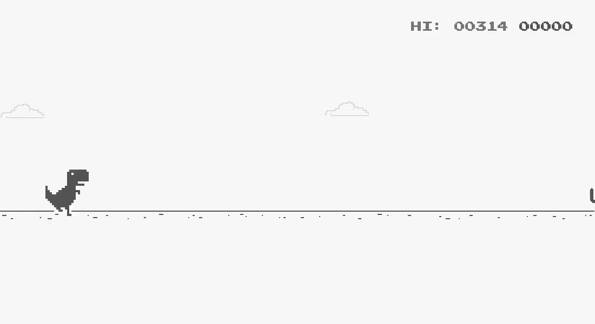

# Chrome Dino Game

The project is an implementation of the popular Chrome Dino Game using 
Python and Pygame. The game is shown when a user is offline and when opening [chrome://dino](chrome://dino).

Use the space bar or arrow up key to jump and the arrow down key to duck.

## Differences to other Implementations

This project is based on the implementation by [dhhrev](https://github.com/dhhruv/Chrome-Dino-Runner).
However, this project includes major improvements:

- Pixel-accurate collision detection; previously the game only checked
  whether the images overlapped even though they contained a lot of
  white space
- Simplified code structure
- A more appealing menu and better display of the score
- Clouds in the background
- Smoother animations, including 60 fps instead of 30
- More than one obstacle per frame

# Extensability

This project makes it easy to extend it because of its simple file
structure. It is especially well-suited for machine learning
applications.

To do that, create a new folder in `src` that includes a custom
implementation of `chromedino.py`. Since the other game elements are
each contained in their own files, they can easily be imported. Then
update the `main.py` file to start your extension.

A sample machine learning implementation is available at [Scr1pting/Chrome-Dino-AI](https://github.com/Scr1pting/Chrome-Dino-AI).
Have fun exploring!

## Run

Run `python3 src/main.py` to play the game.
Make sure to have [Pygame](https://www.pygame.org/docs/) installed!
